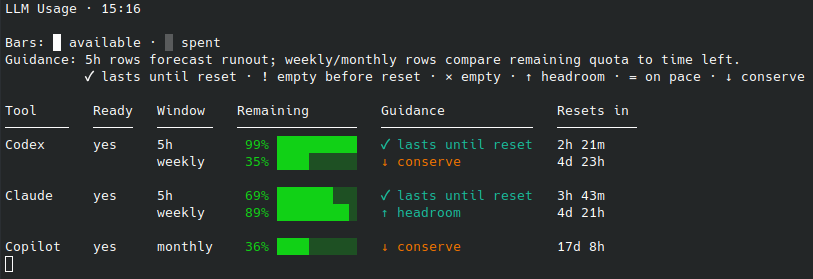

# llm-tools


[](https://github.com/chrisgleissner/llm-tools/actions/workflows/test.yml)
[](https://codecov.io/gh/chrisgleissner/llm-tools)
[](https://www.apache.org/licenses/LICENSE-2.0)
[](https://github.com/chrisgleissner/llm-tools/releases)

Small command-line tools for keeping local LLM CLIs productive, observable, and usable across rate-limit windows. They run on Linux and macOS; the wake/suspend features are Linux-only (see [Requirements](#requirements)).

## What Each Tool Is For

| Tool            | Use it when you want to...                                                                                  |
| --------------- | ----------------------------------------------------------------------------------------------------------- |
| `llm-usage`     | See remaining local usage for Codex, Claude Code, and GitHub Copilot before starting work.                  |
| `llm-scheduler` | Submit one prompt to one selected CLI as soon as that CLI has usable capacity.                              |
| `ralph-robin`   | Keep autonomous work moving by rotating across configured CLIs instead of stopping at the first rate limit. |



## Required Dependencies

These tools drive the official command-line clients of the supported LLM providers. Install the CLI for each provider you want to use:

| Provider       | CLI binary             | Download / install                                                                                    |
| -------------- | ---------------------- | ----------------------------------------------------------------------------------------------------- |
| OpenAI Codex   | `codex`                | [github.com/openai/codex](https://github.com/openai/codex) — `npm install -g @openai/codex`           |
| Claude Code    | `claude`               | [claude.com/product/claude-code](https://www.claude.com/product/claude-code) — `npm install -g @anthropic-ai/claude-code` |
| GitHub Copilot | `copilot`              | [github.com/github/copilot-cli](https://github.com/github/copilot-cli) — `npm install -g @github/copilot` |

After installing, authenticate each CLI once (e.g. `codex`, `claude`, `copilot`) so it has a usable local session.

**You do not need all of them.** Every tool works with whatever subset of provider CLIs is installed and authenticated:

* `llm-usage` shows `unavailable` for any provider it cannot read and still reports the rest.
* `llm-scheduler` only needs the one provider you target with `--tool`.
* `ralph-robin` skips providers it cannot use and rotates across the ones that are available (its default rotation is `claude,codex`; narrow or widen it with `--tools`).

## Install

Install with [pipx](https://pipx.pypa.io) so the commands land on your `PATH` and can be run from any directory — no checkout required:

```bash
pipx install git+https://github.com/chrisgleissner/llm-tools.git
```

`pipx` keeps each tool in its own virtual environment, so this also works on externally managed systems (Debian/Ubuntu, Homebrew Python) where installing into the system interpreter is blocked with an `externally-managed-environment` error. If you do not have `pipx` yet: `python3 -m pip install --user pipx && python3 -m pipx ensurepath` (or `brew install pipx` on macOS), then open a new shell.

Verify the commands are on your `PATH`:

```bash
command -v llm-usage
command -v llm-scheduler
command -v ralph-robin
```

Prefer a pre-built artifact? Each [release](https://github.com/chrisgleissner/llm-tools/releases) ships a wheel ZIP archive you can install without a build step:

```bash
pipx install https://github.com/chrisgleissner/llm-tools/releases/download/0.2.1/llm_tools-0.2.1-py3-none-any.whl
```

### From a local checkout

If you have cloned the repository, install it from the working tree:

```bash
pipx install .
```

Or into a virtual environment:

```bash
python3 -m venv .venv && . .venv/bin/activate
python -m pip install .
```

Or run the tools straight from a checkout without installing:

```bash
./llm-usage
./llm-scheduler
./ralph-robin
```

## Quick Start

```bash
llm-usage
llm-scheduler --tool codex --prompt-file task.md
ralph-robin --prompt-file task.md
llm-scheduler --tool claude --window 5h --prompt-file task.md --suspend-until-ready
```

Follow the latest scheduler run:

```bash
tail -f ~/.cache/llm-tools/llm-scheduler/logs/latest/run.log
tail -f ~/.cache/llm-tools/llm-scheduler/logs/latest/attempt-1.out
```

## `llm-usage`

Use `llm-usage` before starting work, in status lines, or in scripts that need a compact view of local usage state.

```bash
llm-usage
llm-usage --json
llm-usage --watch 60
llm-usage --show-copilot-credits
llm-usage --show-source
llm-usage --statusline
```

By default, it shows all supported providers:

```text
LLM Usage · 13:03

Bars: █ available · ░ spent
Guidance: 5h rows forecast runout; weekly/monthly rows compare remaining quota to time left.
          ✓ lasts until reset · ! empty before reset · × empty · ↑ headroom · = on pace · ↓ conserve

Tool       Ready   Window    Remaining         Guidance              Resets in
────────   ─────   ───────   ───────────────   ───────────────────   ──────────
Codex      yes     5h        90% █████████░    ✓ lasts until reset   4h 34m
                   weekly    34% ███░░░░░░░    ↓ conserve            5d 2h

Claude     no      5h         0% ░░░░░░░░░░    × empty               36m
                   weekly    91% █████████░    ↑ headroom            5d

Copilot    yes     monthly   36% ████░░░░░░    ↓ conserve            17d 11h
```

The table is meant to answer four questions quickly:

- **Ready** — `yes` means every blocking quota window for that tool has usable capacity now; `no` means at least one blocking window must reset.
- **Guidance** — `5h` rows forecast whether current burn lasts until reset; weekly and monthly rows compare remaining quota to a linear budget pace.
- **Remaining** — remaining quota, with the exact percentage before the bar.
- **Resets in** — relative reset time first, so near-term recovery is easy to scan.

Short and long windows can disagree. For example, a 5h row may last until reset while a weekly row says `↓ conserve`; treat the slower long-window row as the limiting constraint.

Options:

| Option                   | Purpose                                                                  |
| ------------------------ | ------------------------------------------------------------------------ |
| `--json`                 | Print stable JSON with `generated_at`, `codex`, `claude`, and `copilot`. |
| `--watch/-w SECONDS`     | Refresh continuously.                                                    |
| `--show-source`          | Show where each usage row came from.                                     |
| `--show-copilot-credits` | Include Copilot AI credits when parseable.                               |
| `--show-remaining-time`  | Show burn-time estimates.                                                |
| `--hide-remaining-time`  | Hide burn-time estimates (default).                                      |
| `--show-daily-budget`    | Show the Guidance column (default).                                      |
| `--hide-daily-budget`    | Hide the Guidance column.                                                |
| `--show-codex-spark`     | Show Codex Spark rows.                                                   |
| `--hide-codex-spark`     | Hide Codex Spark rows.                                                   |
| `--statusline`           | Read Claude Code statusline JSON from stdin and cache it.                |

## `llm-scheduler`

Use `llm-scheduler` when one specific provider should run one specific prompt, but only once capacity is available.

It is best for delayed launches, rate-limit-aware retries, tmux launches, wake scheduling, and suspend-until-ready workflows.

```bash
llm-scheduler --tool codex --prompt-file task.md
llm-scheduler --tool claude --prompt "Continue the work in this repo until CI is green"
llm-scheduler --tool copilot --prompt-file task.md --retry-delays 60,180,600
llm-scheduler --tool codex --prompt-file task.md --at "23:05"
llm-scheduler --tool codex --prompt-file task.md --tmux llm-work
llm-scheduler --tool codex --prompt-file task.md --wake
llm-scheduler --tool claude --prompt-file task.md --window 5h --suspend-until-ready
llm-scheduler --tool codex --prompt-file task.md --dry-run
```

Required form:

```bash
llm-scheduler --tool codex|claude|copilot (--prompt TEXT | --prompt-file FILE) [options]
```

Behavior:

* Interactive terminal: launches the provider directly and writes `attempt-N.out`.
* Headless or non-terminal mode: runs the provider through a captured PTY.
* tmux mode: runs inside the requested tmux session/window.
* Exits after success, terminal failure, or retry exhaustion.

Options:

| Option                                | Purpose                                                                                                                                      |
| ------------------------------------- | -------------------------------------------------------------------------------------------------------------------------------------------- |
| `--at TIME`                           | Delay launch until a `date -d` compatible local time.                                                                                        |
| `--not-before TIME`                   | Do not launch before a `date -d` compatible local time.                                                                                      |
| `--window auto\|5h\|weekly\|monthly`  | Select usage windows. `auto` checks known Codex and Claude limiting windows plus Copilot monthly usage.                                      |
| `--min-remaining PERCENT`             | Minimum remaining capacity required to launch. Default: `1`.                                                                                 |
| `--poll-interval SECONDS`             | Usage polling interval. Default: `60`.                                                                                                       |
| `--max-unavailable-wait SECONDS`      | Maximum wait when usage cannot be measured. Default: `900`; `0` waits forever. Known rate limits with real reset times still wait for reset. |
| `--retry-delays LIST`                 | Retry delays. Default: `60,180,600`.                                                                                                         |
| `--no-retry`                          | Disable retries.                                                                                                                             |
| `--cwd DIR`                           | Set provider working directory.                                                                                                              |
| `--fresh`                             | Launch a fresh foreground provider process. Default.                                                                                         |
| `--headless`                          | Force non-interactive provider command and captured PTY.                                                                                     |
| `--tmux SESSION[:WINDOW]`             | Run through tmux.                                                                                                                            |
| `--command-template TEMPLATE`         | Override provider syntax. Supports `{tool}`, `{prompt}`, `{prompt_file}`, and `{cwd}`. Parsed with Python `shlex`, not a shell.              |
| `--auto-confirm`                      | Auto-confirm recognised safe trust prompts. Default.                                                                                         |
| `--no-auto-confirm`                   | Disable safe auto-confirmation.                                                                                                              |
| `--headless-idle-timeout SECONDS`     | Abort headless fresh mode after no output progress. Default: `600`; `0` disables.                                                            |
| `--headless-question-timeout SECONDS` | Abort headless fresh mode after question-like output stalls. Default: `30`; `0` disables.                                                    |
| `--log-dir DIR`                       | Set scheduler log root.                                                                                                                      |
| `--run-dir DIR`                       | Write or resume a specific run directory.                                                                                                    |
| `--dry-run`                           | Resolve usage, timing, command plan, and logs without launching.                                                                             |
| `--wake`                              | Enable best-effort wake scheduling.                                                                                                          |
| `--suspend-until-ready`               | Schedule a resumed run, enable wake, suspend the machine, and continue after wake.                                                           |
| `--wake-test`                         | Print wake diagnostics without scheduling work.                                                                                              |

Default provider commands:

| Mode        | Codex                          | Claude Code                                              | GitHub Copilot                       |
| ----------- | ------------------------------ | -------------------------------------------------------- | ------------------------------------ |
| Interactive | `codex -C <cwd> <prompt>`      | `claude <prompt>`                                        | `copilot -C <cwd> -i <prompt>`       |
| Headless    | `codex exec -C <cwd> <prompt>` | `claude --print <prompt>`                                | `copilot -C <cwd> --prompt <prompt>` |

The default Claude adapter relies on your local Claude Code permission settings. To override Claude Code settings for one scheduler run:

```bash
llm-scheduler --tool claude --prompt-file task.md --command-template 'claude --permission-mode plan --print {prompt}'
```

## `ralph-robin`

Use `ralph-robin` when the task matters more than which LLM provider runs it.

It runs a [Ralph loop](https://venturebeat.com/technology/how-ralph-wiggum-went-from-the-simpsons-to-the-biggest-name-in-ai-right-now/): a persistent autonomous workflow that keeps going instead of stopping when one provider reaches a limit, stalls, or becomes temporarily unusable. This makes it useful for long-running autonomous coding, repair, hardening, documentation, and investigation loops where stopping at the first rate limit would waste time.

`ralph-robin` wraps `llm-scheduler` and rotates (i.e. round-robins, hence the name) across the configured providers. It can rotate only when the current provider is exhausted, or distribute work more evenly to burn down provider limits at a similar rate (default).

When Ralph selects Claude Code through the built-in adapter, it uses Claude's `stream-json` print mode and renders that event stream as readable stdout so assistant text, tool calls, and tool results appear while the run is active.

```bash
ralph-robin --prompt-file task.md
ralph-robin --prompt "Continue until tests pass"
ralph-robin --tools claude,codex,copilot --prompt-file task.md
ralph-robin --prompt-file task.md --tmux llm-work
ralph-robin --prompt-file task.md --dry-run
```

All decisions by ralph-robin, as well as all requests to and output from the underlying CLI LLM tool are logged to stdout:

```text
ralph-robin --prompt-file /home/chris/dev/ralph.prompt.md
[16:22:47] ◆ ralph-robin: · logs: /home/chris/.cache/llm-tools/ralph-robin/logs/20260613-162247-ralph-robin-r67_na63
[16:22:47] ◆ ralph-robin: · usage claude: usable (5h 22% left, weekly 85% left) | codex: usable (5h 99% left, weekly 35% left)
[16:22:47] ◆ ralph-robin: ✓ selected claude (even-burn)
[16:22:52] I'll begin the RALPH loop iteration following FAST-PATH STARTUP. Let me start by establishing current state.
[16:22:54] Tool call: Bash
[16:22:54] {
[16:22:54]   "command": "git status && echo \"---LATEST COMMIT---\" && git log --oneline -5 && echo \"---BRANCH---\" && git branch --show-current",
[16:22:54]   "description": "Check git status, branch, and recent commits"
[16:22:54] }
```

Options:

| Option               | Purpose                                                                                                    |
| -------------------- | ---------------------------------------------------------------------------------------------------------- |
| `--tools LIST`       | Set comma-separated rotation. Values: `claude`, `codex`, `copilot`.                                        |
| `--prompt TEXT`      | Prompt text passed to the selected provider.                                                               |
| `--prompt-file FILE` | Prompt file passed to the selected provider.                                                               |
| `--even-burn`        | Spread work to burn each provider's weekly quota down evenly (see Behavior below). Enabled by default.      |
| `--no-even-burn`     | Keep using the current provider until it is exhausted.                                                      |
| `--max-iterations N` | Stop after `N` successful increments. Default `0` means no iteration cap; use `1` for single-shot. |
| `--max-duration D`   | Stop once `D` of wall-clock time elapses (e.g. `24h`, `90m`, `30s`, or seconds). Default `24h`; `0` disables. Whichever of `--max-iterations`/`--max-duration` is hit first wins. |
| `--state-file FILE`  | Store current provider index. Default: `${XDG_CACHE_HOME:-$HOME/.cache}/llm-tools/ralph-robin/state.json`. |
| `--log-dir DIR`      | Set Ralph log directory. Default: `${XDG_CACHE_HOME:-$HOME/.cache}/llm-tools/ralph-robin/logs`.            |

Passed through to `llm-scheduler`:

```text
--window
--min-remaining
--poll-interval
--max-unavailable-wait
--retry-delays
--cwd
--fresh
--headless
--tmux
--command-template
--auto-confirm
--no-auto-confirm
--headless-idle-timeout
--headless-question-timeout
```

Behavior:

* Defaults to autonomous headless launches, even from an interactive terminal.
* Defaults to even burn-down: selects the provider with the highest remaining *daily* capacity — weekly remaining % ÷ days until weekly reset (e.g. 80% with 4 days left is 20%/day) — even if it must first wait for a shorter session-window reset. This spreads each weekly quota evenly across the days until it resets. A provider with an unknown or stale weekly reset is assumed to have a full week, so it is still ranked rather than skipped.
* Loops persistently: after each provider finishes an increment, Ralph re-evaluates usage, re-selects a provider, and submits the prompt again — so a long task is handed back and forth (e.g. Claude → ralph-robin → Claude). It does **not** stop when every provider is blocked: it owns the suspend decision and waits for the rotation to recover. The loop ends only on a non-recoverable failure, a degenerate instant-success streak, or once `--max-duration` / `--max-iterations` is reached.
* When **all** providers are rate-limited, Ralph suspends the computer with an RTC wake-up timer set to the **earliest** provider window renewal across the whole rotation, then on wake resumes its *own* loop and re-evaluates which provider to use. (When suspend infrastructure is unavailable, the lead time is too short, or `LLM_SCHEDULER_NO_ACTUAL_SUSPEND=1`/`--dry-run` is set, it falls back to an in-process wait.) This is distinct from `llm-scheduler --suspend-until-ready`, which wakes into a single configured provider; Ralph wakes back into cross-provider rotation.
* Streams provider output without injected labels.
* Highlights status lines, diffs, commands, warnings, and errors on interactive terminals.
* Disables colors for non-TTY output, `TERM=dumb`, `NO_COLOR`, or `LLM_USAGE_NO_COLOR`.
* If usage cannot be measured, tries that provider before suspending.
* If a provider exits with a scheduler autonomy abort, skips it for the current invocation and tries the next usable provider.

Color overrides:

```bash
LLM_TOOLS_COLOR_ERROR='1;34'
```

Supported color roles:

```text
BRAND, INFO, OK, WARN, ERROR, DIM, DIFF_ADD, DIFF_REMOVE, DIFF_HUNK,
COMMAND, TOOL, STDERR, HEADING
```

Symbol overrides:

```bash
LLM_TOOLS_SYMBOL_ERROR=!
LLM_TOOLS_NO_SYMBOLS=1
```

Ralph-launched provider processes inherit:

```text
LLM_TOOLS_RALPH_ROBIN_ACTIVE=1
LLM_TOOLS_RALPH_ROBIN_SELECTED_TOOL
LLM_TOOLS_RALPH_ROBIN_TOOLS
```

If a child tries to run `llm-scheduler --suspend-until-ready` while Ralph is active, the scheduler exits with status `75` instead of suspending. Ralph remains the single rotation and suspend coordinator.

## Logs and Cache

Runtime data lives under:

```text
${XDG_CACHE_HOME:-$HOME/.cache}/llm-tools
```

Layout:

```text
llm-tools/llm-usage/                 Usage caches and llm-usage.log
llm-tools/llm-scheduler/logs/        Per-run scheduler logs
llm-tools/ralph-robin/               Ralph state and logs
```

Each scheduler run directory contains:

```text
run.log
events.jsonl
prompt.txt
attempt-N.out
attempt-N.status
```

The scheduler logs arguments, prompt source, prompt SHA-256, prompt content, usage snapshots, wait decisions, command plan, output, exit code, retry delays, and final status.

Symlinks:

```text
~/.cache/llm-tools/llm-scheduler/logs/latest
~/.cache/llm-tools/llm-scheduler/logs/latest-claude
~/.cache/llm-tools/llm-scheduler/logs/latest-codex
```

Ralph logs live under:

```text
${XDG_CACHE_HOME:-$HOME/.cache}/llm-tools/ralph-robin/logs
```

Child scheduler logs are written under each Ralph run’s `scheduler/` subdirectory.

## Data Sources

* Codex: local JSONL under `~/.codex/sessions`.
* Claude Code: OAuth usage API/cache, statusline cache, then local project JSONL fallback.
* GitHub Copilot: local Copilot CLI footer captured through a bounded PTY helper.

The Copilot footer only shows plan/session usage when the `quota` and `ai-used` status-line items are enabled (off by default on a fresh install, normally toggled via `/statusline`). Before each capture, `llm-usage` enables those items in `$COPILOT_HOME/settings.json` (default `~/.copilot/settings.json`), preserving all other settings. Set `LLM_USAGE_COPILOT_NO_SETTINGS_WRITE=1` to skip this.

Copilot capture is cached with `LLM_USAGE_COPILOT_CACHE_TTL`. Default: `300`. Set `LLM_USAGE_COPILOT_CACHE_TTL=0` to force synchronous capture.

## Wake Support

`llm-scheduler --wake` is best effort. It prefers a transient user `systemd-run` timer with `WakeSystem=true`; otherwise it logs an `rtcwake` fallback command.

`llm-scheduler --suspend-until-ready` schedules a resumed scheduler invocation, then calls `systemctl suspend` after the timer is accepted.

Configure the pre-suspend confirmation pause:

```bash
LLM_SCHEDULER_PRE_SUSPEND_CONFIRMATION_SECONDS=10
```

Wake reliability depends on firmware/BIOS settings, motherboard RTC support, kernel support, systemd user timers, and power state. The tool does not modify BIOS/UEFI settings and does not silently require `sudo`.

Diagnostics:

```bash
llm-scheduler --wake-test
```

## Requirements

* Linux or macOS. The wake and suspend features (`--wake`, `--suspend-until-ready`) need Linux with systemd; everything else works on both.
* Python 3.11 or newer.
* Optional: `copilot` or `github-copilot` for Copilot usage capture.
* Optional: `tmux` for tmux mode.
* Optional: `systemd-run` or `rtcwake` for wake support.

## Limitations

* Uses local data and locally authenticated CLIs only.
* Not an official billing dashboard.
* Missing or inconclusive provider data is shown as `-`, `unknown`, or `unavailable`.
* If usage remains unavailable beyond `--max-unavailable-wait`, the scheduler launches optimistically and lets provider rate-limit handling and retry behavior take over.
* Provider local data formats and CLI syntax can change.
* Copilot AI credits are parsed when requested, but scheduler gating currently uses monthly remaining usage.

## Tests

```bash
python -m pip install -e . pytest coverage
coverage run -m pytest
coverage combine
coverage report --fail-under=85
```

Tests use fixtures and mock commands. They do not require real Codex, Claude, Copilot, credentials, network access, or the user’s real home directory.

For manual end-to-end checks, run the examples above against installed providers without the test fixture environment.

## License

Apache License 2.0.
