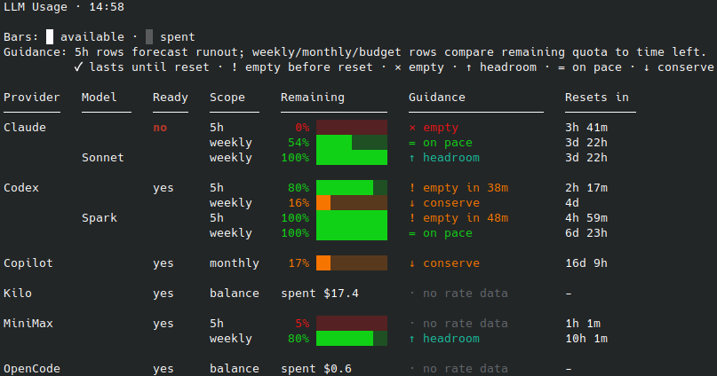

# llm-tools


[](https://github.com/chrisgleissner/llm-tools/actions/workflows/test.yml)
[](https://codecov.io/gh/chrisgleissner/llm-tools)
[](https://www.apache.org/licenses/LICENSE-2.0)
[](https://github.com/chrisgleissner/llm-tools/releases)

`llm-tools` is a small set of command-line tools for staying on top of local LLM provider capacity: session windows, weekly limits, quotas, credit balances, cost budgets, and provider availability.

The goal is to make LLM CLI work **more observable and less wasteful**. You can see which providers still have capacity, avoid burning weekly limits blindly, and dispatch tasks as soon as a provider becomes usable again instead of leaving open session windows idle.

The tools are intentionally **local- and CLI-first**. Instead of introducing another authentication layer, they use the provider CLIs you already have installed and authenticated. Credentials stay with those tools, and normal use remains zero-config.

Supported providers include: **Codex, Claude Code, GitHub Copilot, Kilo Code, MiniMax, and OpenCode**.

## Tools at a Glance

| Command         | Use it when you want to...                                                                       |
| --------------- | ------------------------------------------------------------------------------------------------ |
| `llm-usage`     | Check remaining LLM capacity before starting work.                                               |
| `llm-scheduler` | Run one prompt through one selected provider once that provider has usable capacity.             |
| `ralph-robin`   | Keep autonomous work moving by rotating across providers instead of stopping at the first limit. |



## Install

Install with [pipx](https://pipx.pypa.io):

```bash
pipx install git+https://github.com/chrisgleissner/llm-tools.git
```

This puts the commands on your `PATH` and keeps the package in its own virtual environment. It also works on externally managed Python installations such as Debian, Ubuntu, and Homebrew Python.

If you do not have `pipx` yet:

```bash
python3 -m pip install --user pipx
python3 -m pipx ensurepath
```

On macOS, you can also use Homebrew:

```bash
brew install pipx
```

Open a new shell, then verify the commands are available:

```bash
command -v llm-usage
command -v llm-scheduler
command -v ralph-robin
```

### Install from a Release Wheel

Each [release](https://github.com/chrisgleissner/llm-tools/releases) ships a wheel ZIP archive. You can install the wheel directly:

```bash
pipx install https://github.com/chrisgleissner/llm-tools/releases/download/0.2.3/llm_tools-0.2.3-py3-none-any.whl
```

### Install from a Local Checkout

From a cloned repository:

```bash
pipx install .
```

Or install into a virtual environment:

```bash
python3 -m venv .venv
. .venv/bin/activate
python -m pip install .
```

You can also run the tools directly from a checkout:

```bash
./llm-usage
./llm-scheduler
./ralph-robin
```

## Quick Start

Check current capacity:

```bash
llm-usage
llm-usage --watch 60
```

Run a prompt once a specific provider is ready:

```bash
llm-scheduler --provider codex --prompt-file task.md
llm-scheduler --provider kilo --prompt-file task.md
llm-scheduler --provider minimax --prompt-file task.md
```

Keep work moving across providers:

```bash
ralph-robin --prompt-file task.md
```

Follow the latest scheduler run:

```bash
tail -f ~/.cache/llm-tools/llm-scheduler/logs/latest/run.log
tail -f ~/.cache/llm-tools/llm-scheduler/logs/latest/attempt-1.out
```

## Provider CLI Requirements

`llm-tools` drives the official command-line clients for each provider. Install and authenticate the CLI for each provider you want to use.

| Provider       | CLI binary | Install                                                                                                                   |
| -------------- | ---------- | ------------------------------------------------------------------------------------------------------------------------- |
| Claude Code    | `claude`   | [claude.com/product/claude-code](https://www.claude.com/product/claude-code) - `npm install -g @anthropic-ai/claude-code` |
| Codex          | `codex`    | [github.com/openai/codex](https://github.com/openai/codex) - `npm install -g @openai/codex`                               |
| GitHub Copilot | `copilot`  | [github.com/github/copilot-cli](https://github.com/github/copilot-cli) - `npm install -g @github/copilot`                 |
| Kilo Code      | `kilo`     | [kilo.ai](https://kilo.ai) - `npm install -g @kilocode/cli`                                                               |
| MiniMax        | `mmx`      | [platform.minimax.io](https://platform.minimax.io/) - `npm install -g mmx-cli`                                            |
| OpenCode       | `opencode` | [opencode.ai](https://opencode.ai/) - `npm install -g opencode-ai`                                                        |

You do not need every provider CLI installed.

* `llm-usage` reports unavailable providers as `unavailable` and still shows the rest.
* `llm-scheduler` only needs the provider selected with `--provider`.
* `ralph-robin` skips unavailable providers and rotates across the usable ones. Its default rotation is `claude,codex`; use `--providers` to change it.

## Capacity Scopes

`llm-tools` calls every quota-like constraint a **scope**.

A scope is one capacity measure exposed by one provider. For example, Codex and Claude can expose `5h` and `weekly` reset windows, while Kilo can expose a credit balance or monthly budget.

| Kind           | Resets? | Examples                             | Providers                       |
| -------------- | ------- | ------------------------------------ | ------------------------------- |
| `reset_window` | yes     | `5h`, `weekly`, `monthly`            | Codex, Claude, Copilot, MiniMax |
| `balance`      | no      | Kilo credit balance, GBP/USD/credits | Kilo, OpenCode                  |
| `budget`       | yes     | Monthly spend budget                 | Kilo, OpenCode                  |
| `ungated`      | n/a     | BYOK, local, ungated mode            | Kilo, OpenCode                  |

`llm-usage` shows one row per scope. `llm-scheduler` and `ralph-robin` can gate on a specific scope with `--scope`.

Per-provider scope allow-lists:

| Provider       | Supported `--scope` values                     |
| -------------- | ---------------------------------------------- |
| Codex          | `auto`, `5h`, `weekly`                         |
| Claude Code    | `auto`, `5h`, `weekly`                         |
| MiniMax        | `auto`, `5h`, `weekly`                         |
| GitHub Copilot | `auto`, `monthly`                              |
| Kilo Code      | `auto`, `balance`, `budget`, `byok`, `ungated` |
| OpenCode       | `auto`, `balance`, `budget`, `byok`, `ungated` |

## `llm-usage`

Use `llm-usage` before starting work, in status lines, or in scripts that need a compact view of local LLM capacity.

```bash
llm-usage
llm-usage --json
llm-usage --watch 60
llm-usage --show-copilot-credits
llm-usage --show-source
llm-usage --statusline
```

Default output shows all supported providers, with one row per capacity scope:

```text
LLM Usage · 13:03

Bars: █ available · ░ spent
Guidance: 5h rows forecast runout; weekly/monthly/budget rows compare remaining quota to time left.
          ✓ lasts until reset · ! empty before reset · × empty · ↑ headroom · = on pace · ↓ conserve

Provider   Model     Ready   Scope     Remaining         Guidance              Resets in
────────   ───────   ─────   ───────   ───────────────   ───────────────────   ──────────
Codex                yes     5h        90% █████████░    ✓ lasts until reset   4h 34m
                             weekly    34% ███░░░░░░░    ↓ conserve            5d 2h
           Spark             5h       100% ██████████    ✓ lasts until reset   4h 34m
                             weekly    96% █████████░    ↑ headroom            6d 1h

Claude               no      5h         0% ░░░░░░░░░░    × empty               36m
                             weekly    91% █████████░    ↑ headroom            5d
           Sonnet            weekly   100% ██████████    ↑ headroom            5d

Copilot              yes     monthly   36% ████░░░░░░    ↓ conserve            17d 11h

Kilo                 yes     balance   £12.40            ✓ funded              -
                             budget    62% ██████░░░░    ↑ headroom            17d 4h
```

The `Model` column only appears when a provider reports model-specific limits.
These sub-rows sit under their provider's section: Codex surfaces its `Spark`
model, and Claude surfaces per-model weekly limits (e.g. `Sonnet`) alongside the
aggregate window. Model rows are informational — they are shown for visibility
but do not gate scheduling, which always uses the provider's aggregate scopes.

How to read the table:

| Column      | Meaning                                                                                                                                            |
| ----------- | -------------------------------------------------------------------------------------------------------------------------------------------------- |
| `Model`     | The specific model a row reports on (e.g. `Spark`, `Sonnet`). Blank for a provider's aggregate rows. Only shown when model-specific data exists.   |
| `Ready`     | `yes` means every blocking scope for that provider has usable capacity now. `no` means at least one scope must reset or recover.                   |
| `Scope`     | The capacity measure, such as `5h`, `weekly`, `monthly`, `balance`, or `budget`.                                                                   |
| `Remaining` | Remaining percentage, balance, or an unmetered state such as `byok`, `local`, or `ungated`.                                                        |
| `Guidance`  | For `5h`, whether current burn should last until reset. For weekly, monthly, and budget scopes, whether usage is ahead of or behind a linear pace. |
| `Resets in` | Relative reset time. Non-reset scopes show `-`.                                                                                                    |

### `llm-usage` Options

| Option                   | Purpose                                                                                                 |
| ------------------------ | ------------------------------------------------------------------------------------------------------- |
| `-j`, `--json`           | Print stable JSON with `generated_at`, `codex`, `claude`, `copilot`, `kilo`, `opencode`, and `minimax`. |
| `-w`, `--watch SECONDS`  | Refresh continuously.                                                                                   |
| `-C`, `--show-copilot-credits` | Include Copilot AI credits when parseable.                                                        |
| `-S`, `--show-source`    | Show where each usage row came from.                                                                    |
| `-s`, `--hide-source`    | Hide the source column. This is the default.                                                            |
| `-R`, `--show-remaining-time` | Show burn-time estimates.                                                                          |
| `-r`, `--hide-remaining-time` | Hide burn-time estimates. This is the default.                                                    |
| `-D`, `--show-daily-budget` | Show the `Guidance` column. This is the default.                                                     |
| `-d`, `--hide-daily-budget` | Hide the `Guidance` column.                                                                          |
| `-K`, `--show-codex-spark` | Show Codex Spark rows.                                                                                |
| `-k`, `--hide-codex-spark` | Hide Codex Spark rows.                                                                                |
| `-M`, `--copilot-monthly-reset-offset-days DAYS` | Day offset from month start for Copilot monthly reset.                         |
| `-p`, `--provider-parallelism N` | Number of provider readers to run concurrently. Default: CPU cores; env: `LLM_USAGE_PROVIDER_PARALLELISM`. |
| `-t`, `--statusline`     | Read Claude Code statusline JSON from stdin and cache it.                                               |
| `-l`, `--log-only`       | Sample providers and append to the usage log without printing a table.                                  |
| `-n`, `--no-header`      | Omit the table header.                                                                                  |
| `-h`, `--help`           | Show help.                                                                                              |

## `llm-scheduler`

Use `llm-scheduler` when you want one specific provider to run one specific prompt, but only after that provider has usable capacity.

It is useful for:

* delayed launches
* rate-limit-aware retries
* tmux launches
* wake scheduling
* suspend-until-ready workflows

### Basic Usage

```bash
llm-scheduler --provider codex --prompt-file task.md
llm-scheduler --provider claude --prompt "Continue the work in this repo until CI is green"
llm-scheduler --provider copilot --prompt-file task.md --retry-delays 60,180,600
llm-scheduler --provider kilo --prompt-file task.md
llm-scheduler --provider minimax --prompt-file task.md
```

Required form:

```bash
llm-scheduler --provider codex|claude|copilot|kilo|minimax (--prompt TEXT | --prompt-file FILE) [options]
```

### Common Examples

Run after a specific local time:

```bash
llm-scheduler --provider codex --prompt-file task.md --at "23:05"
```

Run inside tmux:

```bash
llm-scheduler --provider codex --prompt-file task.md --tmux llm-work
```

Schedule a wake-up:

```bash
llm-scheduler --provider codex --prompt-file task.md --wake
```

Suspend until the selected provider is ready:

```bash
llm-scheduler --provider claude --prompt-file task.md --scope 5h --suspend-until-ready
```

Show the resolved plan without launching:

```bash
llm-scheduler --provider codex --prompt-file task.md --dry-run
```

### Runtime Behavior

* In an interactive terminal, the provider is launched directly and output is written to `attempt-N.out`.
* In headless or non-terminal mode, the provider runs through a captured PTY.
* In tmux mode, the provider runs inside the requested tmux session or window.
* The scheduler exits after success, terminal failure, or retry exhaustion.

### `llm-scheduler` Options

| Option                                                              | Purpose                                                                                                                                            |
| ------------------------------------------------------------------- | -------------------------------------------------------------------------------------------------------------------------------------------------- |
| `-P`, `--provider PROVIDER`                                         | Provider: `codex`, `claude`, `copilot`, `kilo`, `opencode`, or `minimax`.                                                                          |
| `-p`, `--prompt TEXT`                                               | Prompt text.                                                                                                                                       |
| `-f`, `--prompt-file FILE`                                          | Read prompt from `FILE`, preserving content.                                                                                                       |
| `-a`, `--at TIME`                                                   | Delay launch until a `date -d` compatible local time.                                                                                              |
| `-a`, `--not-before TIME`                                           | Do not launch before a `date -d` compatible local time.                                                                                            |
| `-s`, `--scope auto\|5h\|weekly\|monthly\|balance\|budget\|byok\|ungated` | Capacity scope to gate on. Default: `auto`.                                                                                              |
| `-W`, `--window SCOPE`                                              | Deprecated alias for `--scope`.                                                                                                                    |
| `-m`, `--min-remaining PERCENT`                                     | Minimum remaining capacity required to launch. Default: `1`.                                                                                       |
| `-i`, `--poll-interval SECONDS`                                     | Usage polling interval. Default: `60`.                                                                                                             |
| `-u`, `--max-unavailable-wait SECONDS`                              | Maximum wait when usage cannot be measured. Default: `900`. Use `0` to wait forever. Known reset times still wait for reset.                       |
| `-r`, `--retry-delays LIST`                                         | Retry delays. Default: `60,180,600`.                                                                                                               |
| `-R`, `--no-retry`                                                  | Disable retries.                                                                                                                                   |
| `-C`, `--cwd DIR`                                                   | Set provider working directory.                                                                                                                    |
| `-F`, `--fresh`                                                     | Launch a fresh foreground provider process. This is the default.                                                                                   |
| `-H`, `--headless`                                                  | Force non-interactive provider command and captured PTY.                                                                                           |
| `-T`, `--tmux SESSION[:WINDOW]`                                     | Run through tmux.                                                                                                                                  |
| `-e`, `--command-template TEMPLATE`                                 | Override provider syntax. Supports `{provider}`, `{prompt}`, `{prompt_file}`, and `{cwd}`. Parsed with Python `shlex`, not a shell.                    |
| `-y`, `--auto-confirm`                                              | Auto-confirm recognised safe trust prompts. This is the default.                                                                                   |
| `-Y`, `--no-auto-confirm`                                           | Disable safe auto-confirmation.                                                                                                                    |
| `-I`, `--headless-idle-timeout SECONDS`                             | Abort headless fresh mode after no output progress. Default: `600`. Use `0` to disable.                                                            |
| `-Q`, `--headless-question-timeout SECONDS`                         | Abort headless fresh mode after question-like output stalls. Default: `30`. Use `0` to disable.                                                    |
| `-L`, `--log-dir DIR`                                               | Set scheduler log root.                                                                                                                            |
| `-O`, `--run-dir DIR`                                               | Write or resume a specific run directory.                                                                                                          |
| `-d`, `--dry-run`                                                   | Resolve usage, timing, command plan, and logs without launching.                                                                                   |
| `-k`, `--wake`                                                      | Enable best-effort wake scheduling.                                                                                                                |
| `-U`, `--suspend-until-ready`                                       | Schedule a resumed run, enable wake, suspend the machine, and continue after wake.                                                                 |
| `-x`, `--wake-test`                                                 | Print wake diagnostics without scheduling work.                                                                                                    |
| `-h`, `--help`                                                      | Show help.                                                                                                                                         |

### Default Provider Commands

| Mode        | Codex                          | Claude Code               | GitHub Copilot                       | Kilo Code                                |
| ----------- | ------------------------------ | ------------------------- | ------------------------------------ | ---------------------------------------- |
| Interactive | `codex -C <cwd> <prompt>`      | `claude <prompt>`         | `copilot -C <cwd> -i <prompt>`       | `kilo run <prompt>` using `--cwd`        |
| Headless    | `codex exec -C <cwd> <prompt>` | `claude --print <prompt>` | `copilot -C <cwd> --prompt <prompt>` | `kilo run --auto <prompt>` using `--cwd` |

The default Claude adapter uses your local Claude Code permission settings. To override Claude Code settings for one scheduler run:

```bash
llm-scheduler --provider claude --prompt-file task.md --command-template 'claude --permission-mode plan --print {prompt}'
```

## `ralph-robin`

Use `ralph-robin` when the task matters more than which provider runs it.

It runs a [Ralph loop](https://venturebeat.com/technology/how-ralph-wiggum-went-from-the-simpsons-to-the-biggest-name-in-ai-right-now/): a persistent autonomous workflow that keeps going instead of stopping when one provider reaches a limit, stalls, or becomes temporarily unusable.

This makes it useful for long-running coding, repair, hardening, documentation, and investigation tasks where stopping at the first rate limit would waste time.

`ralph-robin` wraps `llm-scheduler` and rotates across configured providers. It can either:

* keep using the current provider until it is exhausted
* distribute work more evenly so provider limits burn down at a similar rate

Even burn-down is the default.

When Ralph selects Claude Code through the built-in adapter, it uses Claude's `stream-json` print mode and renders that event stream as readable stdout. Assistant text, tool calls, and tool results appear while the run is active.

### Basic Usage

```bash
ralph-robin --prompt-file task.md
ralph-robin --prompt "Continue until tests pass"
ralph-robin --providers claude,codex,copilot,kilo,minimax --prompt-file task.md
ralph-robin --prompt-file task.md --tmux llm-work
ralph-robin --prompt-file task.md --dry-run
```

Example output:

```text
ralph-robin --prompt-file /home/chris/dev/ralph.prompt.md
[16:22:47] ◆ ralph-robin: · logs: /home/chris/.cache/llm-tools/ralph-robin/logs/20260613-162247-ralph-robin-r67_na63
[16:22:47] ◆ ralph-robin: · usage claude: usable (5h 22% left, weekly 85% left) | codex: usable (5h 99% left, weekly 35% left)
[16:22:47] ◆ ralph-robin: ✓ selected claude (even-burn)
[16:22:52 claude] I'll begin the RALPH loop iteration following FAST-PATH STARTUP. Let me start by establishing current state.
[16:22:54 claude] Tool call: Bash
[16:22:54 claude] {
[16:22:54 claude]   "command": "git status && echo \"---LATEST COMMIT---\" && git log --oneline -5 && echo \"---BRANCH---\" && git branch --show-current",
[16:22:54 claude]   "description": "Check git status, branch, and recent commits"
[16:22:54 claude] }
```

Each relayed provider line is prefixed with `[time provider]` by default. This makes a quiet increment distinguishable from a wedged one and keeps the active provider visible.

Customize the prefix with `--prefix`:

```bash
ralph-robin --prompt-file task.md --prefix time,provider,usage
ralph-robin --prompt-file task.md --prefix none
```

### `ralph-robin` Options

| Option                                                              | Purpose                                                                                                                                                       |
| ------------------------------------------------------------------- | ------------------------------------------------------------------------------------------------------------------------------------------------------------- |
| `-P`, `--providers LIST`                                            | Set comma-separated provider rotation. Values include `claude`, `codex`, `copilot`, `kilo`, `opencode`, and `minimax`.                                       |
| `-p`, `--prompt TEXT`                                               | Prompt text passed to the selected provider.                                                                                                                  |
| `-f`, `--prompt-file FILE`                                          | Prompt file passed to the selected provider.                                                                                                                  |
| `-s`, `--scope auto\|5h\|weekly\|monthly\|balance\|budget\|byok\|ungated` | Capacity scope to gate on. Default: `auto`.                                                                                                         |
| `-W`, `--window SCOPE`                                              | Deprecated alias for `--scope`.                                                                                                                              |
| `-m`, `--min-remaining PERCENT`                                     | Minimum remaining capacity required to launch. Default: `1`.                                                                                                  |
| `-i`, `--poll-interval SECONDS`                                     | Poll interval passed to `llm-scheduler`. Default: `60`.                                                                                                      |
| `-u`, `--max-unavailable-wait SECONDS`                              | Bound inconclusive usage waits before optimistic launch. Default: `900`; `0` waits forever.                                                                  |
| `-r`, `--retry-delays LIST`                                         | Retry delays. Default: `60,180,600`.                                                                                                                          |
| `-R`, `--no-retry`                                                  | Disable retries.                                                                                                                                              |
| `-e`, `--even-burn`                                                 | Spread work to burn provider quota down evenly. Enabled by default.                                                                                           |
| `-E`, `--no-even-burn`                                              | Keep using the current provider until it is exhausted.                                                                                                        |
| `-n`, `--max-iterations N`                                          | Stop after `N` successful increments. Default `0` means no iteration cap. Use `1` for single-shot.                                                            |
| `-D`, `--max-duration D`                                            | Stop once `D` of wall-clock time elapses, such as `24h`, `90m`, `30s`, or seconds. Default: `24h`. Use `0` to disable. Whichever limit is reached first wins. |
| `-I`, `--min-iteration-seconds N`                                   | Minimum runtime floor for successive increments. Default: `5`; `0` disables.                                                                                  |
| `-x`, `--prefix LIST`                                               | Comma-separated fields stamped on each relayed provider line. Fields: `time`, `provider`, `usage`. Default: `time,provider`. Use `none` or an empty value to disable. |
| `-X`, `--prefix-usage-interval S`                                   | Refresh interval in seconds for the cached `usage` prefix field. Default: `15`. Use `0` to refresh every line.                                                |
| `-C`, `--cwd DIR`                                                   | Set provider working directory.                                                                                                                               |
| `-F`, `--fresh`                                                     | Launch a fresh provider process through `llm-scheduler`.                                                                                                      |
| `-H`, `--headless`                                                  | Force non-interactive provider command and captured PTY.                                                                                                      |
| `-T`, `--tmux SESSION[:WINDOW]`                                     | Execute through tmux via `llm-scheduler`.                                                                                                                     |
| `-g`, `--command-template TEMPLATE`                                 | Override provider syntax. Supports `{provider}`, `{prompt}`, `{prompt_file}`, and `{cwd}`.                                                                        |
| `-y`, `--auto-confirm`                                              | Auto-confirm recognised safe trust prompts. This is the default.                                                                                              |
| `-Y`, `--no-auto-confirm`                                           | Disable safe auto-confirmation.                                                                                                                               |
| `-q`, `--headless-idle-timeout SECONDS`                             | Abort headless fresh mode after no output progress. Default: `600`. Use `0` to disable.                                                                       |
| `-Q`, `--headless-question-timeout SECONDS`                         | Abort headless fresh mode after question-like output stalls. Default: `30`. Use `0` to disable.                                                               |
| `-S`, `--state-file FILE`                                           | Store current provider index. Default: `${XDG_CACHE_HOME:-$HOME/.cache}/llm-tools/ralph-robin/state.json`.                                                    |
| `-L`, `--log-dir DIR`                                               | Set Ralph log directory. Default: `${XDG_CACHE_HOME:-$HOME/.cache}/llm-tools/ralph-robin/logs`.                                                               |
| `-k`, `--wake`                                                      | Pass best-effort wake scheduling to `llm-scheduler`.                                                                                                          |
| `-U`, `--suspend-until-ready`                                       | Suspend even for the selected provider's own wait gates.                                                                                                     |
| `-d`, `--dry-run`                                                   | Resolve rotation and usage state without submitting.                                                                                                          |
| `-h`, `--help`                                                      | Show help.                                                                                                                                                    |

The following options are passed through to `llm-scheduler`:

```text
-s, --scope
-m, --min-remaining
-i, --poll-interval
-u, --max-unavailable-wait
-r, --retry-delays
-R, --no-retry
-C, --cwd
-F, --fresh
-H, --headless
-T, --tmux
-g, --command-template
-y, --auto-confirm
-Y, --no-auto-confirm
-q, --headless-idle-timeout
-Q, --headless-question-timeout
```

### `ralph-robin` Behavior

`ralph-robin` owns the full rotation loop: provider selection, retries, waiting, suspend decisions, and handoff between providers.

#### Launch Mode

* Starts provider increments in autonomous headless mode by default, even from an interactive terminal.
* Re-evaluates provider capacity before each increment.
* Submits the same prompt again after each increment, so long-running work can continue across provider boundaries.

#### Provider Selection

By default, `ralph-robin` uses **even burn-down**. When several providers are ready, it prefers the provider with the highest remaining pace-adjusted capacity.

The selector:

* ranks reset-window scopes such as `weekly`
* ranks budget scopes such as Kilo `budget`
* treats `balance` and `ungated` scopes as usable, but not pace-rankable
* assumes an unknown or stale reset has a full week available, so the provider can still be ranked instead of being skipped

Use `--no-even-burn` to keep using the current provider until it is exhausted.

#### Blocking and Recovery

`ralph-robin` does not stop just because every provider is currently blocked.

When no provider is usable, it waits or suspends until the rotation can recover. The loop ends only when one of these conditions is met:

* a non-recoverable failure occurs
* a degenerate instant-success streak is detected
* `--max-duration` is reached
* `--max-iterations` is reached

#### Output Handling

Provider output is streamed live.

On interactive terminals, `ralph-robin` highlights:

* status lines
* diffs
* commands
* warnings
* errors

Colors are disabled automatically for non-TTY output, `TERM=dumb`, `NO_COLOR`, or `LLM_USAGE_NO_COLOR`.

#### Failure Handling

If usage cannot be measured, `ralph-robin` tries that provider before suspending.

If a provider exits with a scheduler autonomy abort, `ralph-robin` skips that provider for the current invocation and tries the next usable provider.


### Suspend and Wake Behavior

When all providers are blocked, Ralph sets an RTC wake-up timer for the earliest known reset across the whole rotation, then resumes its own loop after wake.

If suspend infrastructure is unavailable, the lead time is too short, `LLM_SCHEDULER_NO_ACTUAL_SUSPEND=1` is set, or `--dry-run` is used, Ralph falls back to an in-process wait.

This is different from:

```bash
llm-scheduler --suspend-until-ready
```

That scheduler mode wakes into one selected provider. Ralph wakes back into cross-provider rotation.

## Provider Setup Details

Most providers only need their CLI installed and authenticated once. Kilo and MiniMax also support environment-variable fallbacks, which are useful for CI and deterministic tests.

### Kilo Code

Kilo is configured primarily through environment variables, so it can be driven from CI or Ralph without changing local state.

| Variable                           | Purpose                                                                   |
| ---------------------------------- | ------------------------------------------------------------------------- |
| `LLM_USAGE_KILO_MODE`              | `gateway` (default), `budget`, `byok`, `local`, or `ungated`.             |
| `LLM_USAGE_KILO_BALANCE`           | Remaining credit balance. Required for `balance` scope.                   |
| `LLM_USAGE_KILO_CURRENCY`          | Currency or unit label, such as `GBP`, `USD`, or `credits`.               |
| `LLM_USAGE_KILO_MIN_BALANCE`       | Minimum remaining balance required to consider Kilo usable. Default: `1`. |
| `LLM_USAGE_KILO_MONTHLY_BUDGET`    | Total monthly budget. Enables `budget` scope.                             |
| `LLM_USAGE_KILO_MONTHLY_SPENT`     | Amount already spent in this budget period.                               |
| `LLM_USAGE_KILO_MONTHLY_RESET_DAY` | Day of month the budget resets. Default: `1`.                             |

When `kilo` is on `PATH`, `llm-usage` and `llm-scheduler` try `kilo stats` first. JSON and text output are supported. If that fails or cannot be parsed, they fall back to the environment variables above.

With `--scope auto`, Kilo prefers:

1. `budget`, when configured
2. `balance`, when configured
3. `ungated`

### MiniMax

MiniMax quota is read from the local `mmx` CLI first. Environment variables are available as a fallback for tests and controlled environments.

| Variable                               | Purpose                                                            |
| -------------------------------------- | ------------------------------------------------------------------ |
| `LLM_USAGE_MINIMAX_5H_PERCENT`         | Remaining percentage for the 5h session window, from `0` to `100`. |
| `LLM_USAGE_MINIMAX_5H_RESET_EPOCH`     | Epoch seconds or milliseconds when the 5h window resets.           |
| `LLM_USAGE_MINIMAX_WEEKLY_PERCENT`     | Remaining percentage for the weekly window, from `0` to `100`.     |
| `LLM_USAGE_MINIMAX_WEEKLY_RESET_EPOCH` | Epoch seconds or milliseconds when the weekly window resets.       |
| `LLM_USAGE_MINIMAX_MODEL`              | `model_remains` row to read. Default: `general`.                   |
| `LLM_USAGE_MINIMAX_TIMEOUT`            | Timeout for `mmx quota show`, in seconds. Default: `10`.           |

When `mmx` is on `PATH`, `llm-usage` and `llm-scheduler` try:

```bash
mmx quota show --output json
```

If the CLI is missing or the output cannot be parsed, they fall back to the environment variables above.

The MiniMax reader uses the `general` row from `model_remains` by default and exposes the same `5h` and `weekly` reset windows used by Claude Code and Codex. This lets the table render and gate MiniMax consistently with other reset-window providers.

The MiniMax row appears only when the `mmx` CLI is installed or MiniMax environment variables are set.

## Logs and Cache

Runtime data lives under:

```text
${XDG_CACHE_HOME:-$HOME/.cache}/llm-tools
```

Directory layout:

```text
llm-tools/llm-usage/                 Usage caches and llm-usage.log
llm-tools/llm-scheduler/logs/        Per-run scheduler logs
llm-tools/ralph-robin/               Ralph state and logs
```

Each scheduler run directory contains:

```text
run.log
events.jsonl
prompt.txt
attempt-N.out
attempt-N.status
```

The scheduler logs:

* arguments
* prompt source
* prompt SHA-256
* prompt content
* usage snapshots
* wait decisions
* command plan
* output
* exit code
* retry delays
* final status

Useful symlinks:

```text
~/.cache/llm-tools/llm-scheduler/logs/latest
~/.cache/llm-tools/llm-scheduler/logs/latest-claude
~/.cache/llm-tools/llm-scheduler/logs/latest-codex
```

Ralph logs live under:

```text
${XDG_CACHE_HOME:-$HOME/.cache}/llm-tools/ralph-robin/logs
```

Child scheduler logs are written under each Ralph run's `scheduler/` subdirectory.

## Data Sources

`llm-tools` reads local provider state where possible.

| Provider       | Source                                                                      |
| -------------- | --------------------------------------------------------------------------- |
| Codex          | Live `codex app-server` rate limits, then cache, then local `~/.codex/sessions` JSONL. |
| Claude Code    | OAuth usage API/cache with automatic OAuth token refresh, then statusline cache, then local project JSONL fallback. |
| GitHub Copilot | Local Copilot CLI footer captured through a bounded PTY helper.             |
| Kilo Code      | `kilo stats`, then Kilo environment variables.                              |
| MiniMax        | `mmx quota show --output json`, then MiniMax environment variables.         |

`llm-usage` reads providers concurrently. Configure fan-out with
`--provider-parallelism` or `LLM_USAGE_PROVIDER_PARALLELISM`; the default is
the number of CPU cores.

### How refreshing works

Every provider is **actively refreshed** on each run — `llm-usage` never just
echoes a session log left behind the last time you used a CLI. Each reader asks
the provider for current numbers and only falls back if that fails:

| Provider       | Active refresh → fallback                                                   |
| -------------- | --------------------------------------------------------------------------- |
| Codex          | `codex app-server` (live, turn-free) → last cached payload → local session JSONL |
| Claude Code    | OAuth usage API (auto-refreshing the token) → API cache → statusline cache → project JSONL |
| GitHub Copilot | Background PTY footer capture → cached capture                              |
| Kilo / MiniMax / OpenCode | `kilo stats` / `mmx quota show` / `opencode stats` → environment variables |

A provider only reports `stale-usage` if it cannot be refreshed for a **known
authentication or CLI-startup reason** — e.g. Codex shows `not-authenticated`
(no `~/.codex/auth.json` credentials) or `missing-cli` (the `codex` binary is
not on `PATH`). When the CLI is installed and signed in, you always see live
data.

The local-snapshot fallbacks (Codex/Claude session files) are still treated as
stale after `LLM_USAGE_LOCAL_SNAPSHOT_MAX_AGE` seconds (default `60`, capped at
60) while they claim an active window, so a brief network blip degrades to
"unavailable" rather than to a misleadingly old percentage.

While readers are in flight, `llm-usage` shows a small spinner that erases
itself once the table is ready. In `--watch` mode it docks to the right of the
clock in the header (`LLM Usage · 14:29  ⠙ refreshing usage 3/6`) and the frame
redraws in place — no full-screen wipe, so the dashboard updates without a
flash. It uses only the most portable cursor sequences (`ESC[H`, `ESC[K`,
`ESC[r;cH`, and `ESC 7`/`ESC 8` save-restore), so it renders correctly under
tmux, GNU screen, and a raw telnet PTY. Outside `--watch`, the spinner sits on
`stderr` and self-erases. It is shown only on an interactive terminal, so pipes,
`--json` consumers, and batch scripts stay byte-clean. Disable it with
`LLM_USAGE_NO_PROGRESS=1`.

### GitHub Copilot Notes

The Copilot footer only shows plan/session usage when the `quota` and `ai-used` status-line items are enabled. These are off by default on a fresh install and are normally toggled via `/statusline`.

Before each capture, `llm-usage` enables those items in:

```text
${COPILOT_HOME:-~/.copilot}/settings.json
```

All other settings are preserved.

Set this variable to skip the settings write:

```bash
LLM_USAGE_COPILOT_NO_SETTINGS_WRITE=1
```

Copilot capture is cached with `LLM_USAGE_COPILOT_CACHE_TTL`.

Default:

```bash
LLM_USAGE_COPILOT_CACHE_TTL=300
```

Force synchronous capture:

```bash
LLM_USAGE_COPILOT_CACHE_TTL=0
```

## Wake Support

`llm-scheduler --wake` is best effort.

It prefers a transient user `systemd-run` timer with `WakeSystem=true`. If that is unavailable, it logs an `rtcwake` fallback command.

`llm-scheduler --suspend-until-ready` schedules a resumed scheduler invocation, then calls:

```bash
systemctl suspend
```

after the timer is accepted.

Configure the pre-suspend confirmation pause:

```bash
LLM_SCHEDULER_PRE_SUSPEND_CONFIRMATION_SECONDS=10
```

Wake reliability depends on:

* firmware and BIOS/UEFI settings
* motherboard RTC support
* kernel support
* systemd user timers
* power state

The tool does not modify BIOS/UEFI settings and does not silently require `sudo`.

Run diagnostics with:

```bash
llm-scheduler --wake-test
```

## Appearance and Output Customization

Color override example:

```bash
LLM_TOOLS_COLOR_ERROR='1;34'
```

Supported color roles:

```text
BRAND, INFO, OK, WARN, ERROR, DIM, DIFF_ADD, DIFF_REMOVE, DIFF_HUNK,
COMMAND, TOOL, STDERR, HEADING
```

Symbol override examples:

```bash
LLM_TOOLS_SYMBOL_ERROR=!
LLM_TOOLS_NO_SYMBOLS=1
```

Ralph-launched provider processes inherit:

```text
LLM_TOOLS_RALPH_ROBIN_ACTIVE=1
LLM_TOOLS_RALPH_ROBIN_SELECTED_PROVIDER
LLM_TOOLS_RALPH_ROBIN_PROVIDERS
```

If a child process tries to run `llm-scheduler --suspend-until-ready` while Ralph is active, the scheduler exits with status `75` instead of suspending. Ralph remains the single rotation and suspend coordinator.

## Requirements

* Linux or macOS.
* Python 3.11 or newer.
* Optional: `copilot` or `github-copilot` for Copilot usage capture.
* Optional: `tmux` for tmux mode.
* Optional: `systemd-run` or `rtcwake` for wake support.

Wake and suspend features require Linux with systemd:

```text
--wake
--suspend-until-ready
```

Everything else works on Linux and macOS.

## Limitations

* Uses local data and locally authenticated CLIs only.
* Not an official billing dashboard.
* Missing or inconclusive provider data is shown as `-`, `unknown`, or `unavailable`.
* If usage remains unavailable beyond `--max-unavailable-wait`, the scheduler launches optimistically and lets provider rate-limit handling and retry behavior take over.
* Provider local data formats and CLI syntax can change.
* Copilot AI credits are parsed when requested, but scheduler gating currently uses monthly remaining usage.

## Adding a Provider

`llm-tools` uses a small provider-adapter contract. To add a new CLI, for example `acme-cli`:

1. Add a provider module:

   ```text
   llm_tools/providers/acme.py
   ```

   It should expose:

   ```text
   read(env) -> ProviderSnapshot
   ```

   The snapshot carries zero or more `CapacityScope` objects.

2. Use one of the supported capacity scope kinds:

   ```text
   reset_window
   balance
   budget
   ungated
   unknown
   ```

3. Re-export the module from:

   ```text
   llm_tools/providers/__init__.py
   ```

4. Register supported scopes in:

   ```text
   llm_tools/capacity.PROVIDER_SCOPES
   ```

   Example:

   ```python
   PROVIDER_SCOPES["acme"] = {SCOPE_AUTO, ...}
   ```

5. Add default launch commands under:

   ```text
   llm_tools.scheduler.provider_default_argv
   ```

   Add both attached and headless paths where applicable.

6. Optionally add a highlighting pattern in:

   ```text
   scheduler.highlight_provider_text
   ```

7. Add `--provider` and `--providers` membership in the relevant validators:

   ```text
   scheduler.py
   ralph_robin.py
   ```

After that, the generic decision logic in `llm_tools/capacity.decide` handles the provider's scopes. `llm-usage`, `llm-scheduler`, and `ralph-robin` can then use the new provider through the same model as the existing ones.

## Tests

Install test dependencies:

```bash
python -m pip install -e . pytest coverage
```

Run tests with coverage:

```bash
coverage run -m pytest
coverage combine
coverage report --fail-under=85
```

Tests use fixtures and mock commands. They do not require:

* real Codex, Claude, Copilot, Kilo, or MiniMax installations
* provider credentials
* network access
* the user's real home directory

For manual end-to-end checks, run the examples above against installed and authenticated providers without the test fixture environment.

## Contributing

Small, focused pull requests are welcome.

Before opening a PR, make sure total coverage is at or above `85%`:

```bash
python -m pytest -q
coverage run -m pytest
coverage combine
coverage report --fail-under=85
```

## License

Apache License 2.0.
